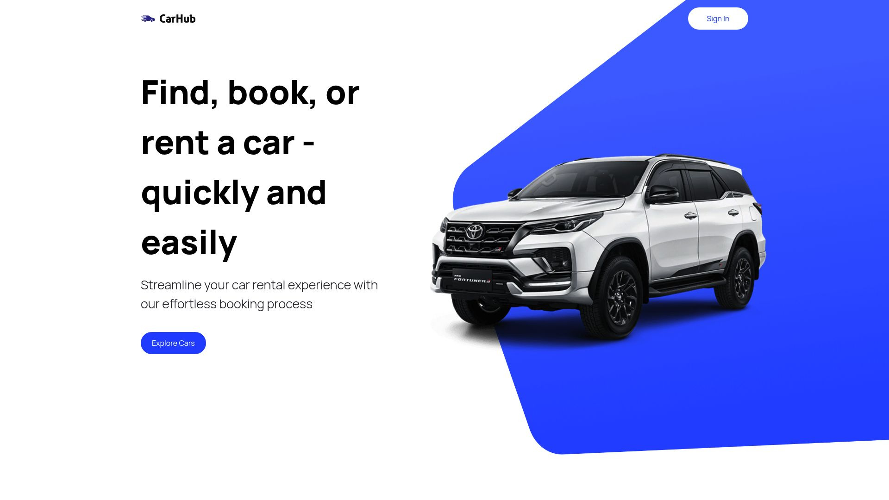

## Car Showcase

[](https://nextjs.org)
[](https://react.dev)
[](https://tailwindcss.com)
[](https://www.typescriptlang.org)

An interactive car catalogue built with Next.js App Router. Search and filter by manufacturer, model, year, and fuel type; browse responsive cards with on-demand images, and load more results seamlessly.



### Demo

- Local dev runs at `http://localhost:3000`
- Deploy-friendly on Vercel

## Features

- **Server-side fetching**: Fetch cars on the server in `app/page.tsx` for fast first paint.
- **Powerful search and filters**: Manufacturer autocomplete, year and fuel filters, keyword search.
- **Image CDN integration**: High-quality car images via Imagin Studio.
- **Responsive UI**: Tailwind CSS, custom components, and accessible UI patterns.
- **Show more pagination**: Incremental loading through URL search params.

## Tech Stack

- **Framework**: Next.js 15 (App Router)
- **Language**: TypeScript 5, React 19
- **Styling**: Tailwind CSS (JIT)
- **UI Utilities**: Headless UI
- **HTTP**: Native `fetch` (server) and `axios` available

## Project Structure

```text
app/                # App Router entry, layout and pages
components/         # Reusable UI components (cards, filters, hero, navbar, footer)
constants/          # Static data (manufacturers, years, fuels, footer links)
public/             # Static assets (logos, icons, background images)
utils/              # Data fetching, URL helpers, image URL generator
types/              # Shared TypeScript interfaces
tailwind.config.js  # Tailwind configuration
next.config.ts      # Next image/domain config
```

## Getting Started

### Prerequisites

- Node.js 18+ and npm (or Yarn/PNPM/Bun)

### Installation

```bash
npm install
# or
yarn
```

### Environment Variables

Create a `.env.local` file in the project root and set your RapidAPI key:

```ini
# Cars by API Ninjas (RapidAPI)
RAPIDAPI_KEY=your_rapidapi_key_here
```

Note: The codebase currently includes a hardcoded key inside `utils/index.ts`. For production use, replace it to read from `process.env.RAPIDAPI_KEY`.

### Run the development server

```bash
npm run dev
# or
yarn dev
```

Open `http://localhost:3000` in your browser.

### Build and start (production)

```bash
npm run build
npm run start
```

## Configuration

- **Images**: `next.config.ts` allows `cdn.imagin.studio` image domain.
- **Tailwind**: Content paths include `app`, `components`, and `pages` with JIT mode enabled.

## Key Modules

- `app/page.tsx`: Server component; reads `searchParams`, calls `fetchCars`, renders filters and results.
- `utils/index.ts`:
  - `fetchCars(filter)`: Calls Cars by API Ninjas via RapidAPI.
  - `generateCarImageUrl(car, angle)`: Builds Imagin Studio image URL.
  - `updateSearchParams(type, value)`: Mutates URL query string client-side.
- `constants/index.ts`: Manufacturers, years, fuels, and footer links.
- `types/index.ts`: Shared props and data types.

## Scripts

- `dev`: Start Next.js dev server (Turbopack)
- `build`: Production build (Turbopack)
- `start`: Start production server

## API Notes

- Base endpoint: `https://cars-by-api-ninjas.p.rapidapi.com/v1/cars`
- Required headers:

```http
x-rapidapi-key: <your_key>
x-rapidapi-host: cars-by-api-ninjas.p.rapidapi.com
```

- Common query params used by this app: `make`, `model`, `year`, `fuel_type`

## Deployment

- Recommended: Deploy to Vercel. The app is optimized for the platform.
- Set the environment variable `RAPIDAPI_KEY` in your project settings.

## Troubleshooting

- **No results shown**: Verify your `RAPIDAPI_KEY` is valid and not rate-limited.
- **Images not loading**: Ensure `cdn.imagin.studio` is listed under `images.domains` in `next.config.ts`.
- **Filters not working**: Clear query params or try different combinations; the API may not return certain makes/models for specific years.

## Roadmap Ideas

- Move RapidAPI key to environment variables (server-only) and add simple proxy route.
- Add client-side caching and loading states.
- Improve pagination with cursor-based API (if available).
- Unit tests for utilities and component tests with React Testing Library.

## License

MIT © 2025
